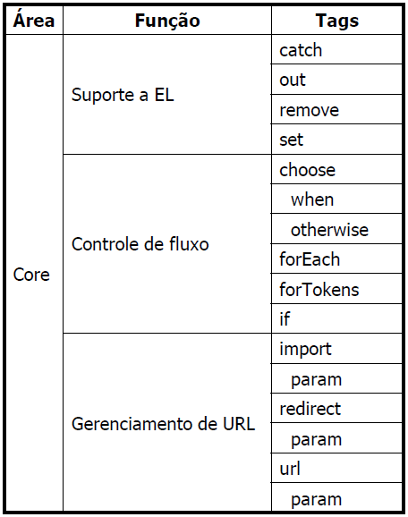

# Aula 12

## JSTL
São tags que ajudam você a fazer muitos comandos de Java pelas tags, você vai conseguir fazer if/foreach/catch com tags do JSTL, vai funcionar igual as tags JSP. Mas você vai precisar da biblioteca JSTL, então leia como instalar elas no README geral do repositório.  

| Funcionalidade    | URI                                    | Prefixo padrão | Exemplo               |
| ----------------- | -------------------------------------- | -------------- | --------------------- |
| Core              | http://java.sun.com/jsp/jstl/core      | c              | <c:tagname ...>       |
| Processamento XML | http://java.sun.com/jsp/jstl/xml       | x              | <x:tagname ...>       |
| Formatação        | http://java.sun.com/jsp/jstl/fmt       | fmt            | <fmt:tagname ...>     |
| SQL               | http://java.sun.com/jsp/jstl/sql       | sql            | <sql:tagname ...>     |
| Funções           | http://java.sun.com/jsp/jstl/functions | fn             | fun:functionName(...) |

Você vai ter que importar esses URI quando quiser usar essas funcionalidade na página JSP.

## JSTL Core
A idéia é tirar todo o código java e trocar por JSTL.  
Usando JSTL Core conseguimos fazer o seguinte  


### Utilizando

Para começar a usar JSTL Core precisamos dizer que queremos usar ela e com qual prefixo.  
```JSP
<%@ taglib prefix="c" uri="http://java.sun.com/jsp/jstl/core" %>
```
Agora as tags do JSTL Core funcionam, vamos ver uma por uma.  

---

**<c:out>**  
Escreve na página em formato de string o que foi mandado.  
```JSP
<c:out value="texto a aparecer na página" />

<c:out value="${conteudo}">
  Texto caso a variável 'conteudo' seja null
</c:out>

<c:out value="<b>Converte as tags HTML</b>" escsapeXML="true"/>

<c:out value="<b>Não converte as tags HTML</b>" escsapeXML="false"/>
```

**value**: Valor a ser escrito na página, podendo usar Expression Language para dizer qual é o valor.  
**escapeXML**: Se você quer que converta para HTML ou deixar as tags aparecendo mesmo.  

---

**<c:set>**  
Atribui um valor a um atributo em qualquer escopo do JSP (page, request, session, application).  
Se o atributo não existir, ele é criado.  
```JSP
<c:set value="UM" var="nomeDaVariavel" />
<c:out value="${nomeDaVariavel}" />

<c:set value="DOIS" var="nomeDaVariavel2" scope="request"/>
<c:out value="${nomeDaVariavel2}" />

<c:set value="TRES" var="nomeDaVariavel3" request="page"/>
<c:set value="QUATRO" var="nomeDaVariavel3" scope="request"/>
<c:out value="${nomeDaVariavel3}" />

<c:set  var="nomeDaVariavel4" request="page">
Conteudo a ser gravado na variável  
</c:set>

Se for usar objeto, vai precisar do
<jsp:useBean id="objeto" class="bean.NomeDaClasse"/>
<c:set value="123" target="${objeto}" property="valor"/>
```

**value**: Valor a ser gravado na variável, podendo usar Expression Language para dizer qual é o valor.  
**var**: Nome da variável onde vai ser gravado o valor. Da mesma maneira que Expression Language, a prioridade é procurar a variável com o nome desejado em page, depois request, depois session e depois applicaiton.  
**scope**: Caso queira um escopo específico você usa esse atributo na tag.  
**target**: Nome do objeto no qual você vai gravar uma variável.  
**property**: Caso seja um objeto, agora você diz a propriedade onde o valor vai ser salvo.  

---

