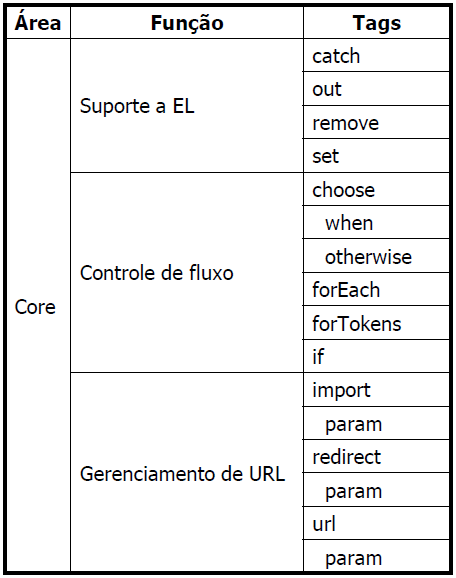

# Aula 12

## JSTL
São tags que ajudam você a fazer muitos comandos de Java pelas tags, você vai conseguir fazer if/foreach/catch com tags do JSTL, vai funcionar igual as tags JSP. Mas você vai precisar da biblioteca JSTL, então leia como instalar elas no README geral do repositório.  

| Funcionalidade    | URI                                    | Prefixo padrão | Exemplo               |
| ----------------- | -------------------------------------- | -------------- | --------------------- |
| Core              | http://java.sun.com/jsp/jstl/core      | c              | <c:tagname ...>       |
| Processamento XML | http://java.sun.com/jsp/jstl/xml       | x              | <x:tagname ...>       |
| Formatação        | http://java.sun.com/jsp/jstl/fmt       | fmt            | <fmt:tagname ...>     |
| SQL               | http://java.sun.com/jsp/jstl/sql       | sql            | <sql:tagname ...>     |
| Funções           | http://java.sun.com/jsp/jstl/functions | fn             | fun:functionName(...) |

Você vai ter que importar esses URI quando quiser usar essas funcionalidade na página JSP.

## JSTL Core
A idéia é tirar todo o código java e trocar por JSTL.  
Usando JSTL Core conseguimos fazer o seguinte  


Para começar a usar JSTL Core precisamos dizer que queremos usar ela e com qual prefixo.  
```JSP
<%@ taglib prefix="c" uri="http://java.sun.com/jsp/jstl/core" %>
```
