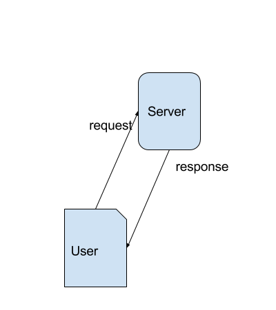

# Aula 3

## Thread
Para resolver o problema de thread acessar um mesmo campo por duas pessoas diferentes, nós temos que suar `synchronized`.  
Se você quiser souber como isso funciona, leia em https://docs.oracle.com/javase/tutorial/essential/concurrency/sync.html  

```JSP
<%!
int variavel_da_classe = 0;
%>

variavel_da_classe = <%=variavel_da_classe%> <br/>

<%
synchronized(this) {
  variavel_da_classe++;
}
%>
```

Basicamente o synchronized probi outros processos de acessarem o que estiver dentro do parênteses enquanto o tiver um processo dentro.  
Ou seja, quando um processo chega na linha do synchronized ele proibi os outros processos de acessarem até ele sair da linha do synchronized. Os processos que estão esperando ficam pausados.  

## Request e Response
Quando um usuário quer algo do nosso site, ele faz um **pedido** daquela coisa do nosso site.  
Nós respondemos ele com uma **resposta**.  
Se você sabe inglês sabe que  
pedido == request  
resposta == response  

E é atráves da variável **request** vamos acessar qualquer informação que o usuário tenha nos passado pelo pedido.  
E é pelo **response** que vamos mandar informações para o usuário.  


Antes de falar mais sobre request e response, vamos falar de **get** e **post**.  

### Get e Post
Se você já usou PHP/HTML grande chance de você já ter visto formulários.  
Formulários ficam dentro da tag HTML `form`.  
```JSP
<form action="" method="">

</form>
```

Tudo dentro da tag form vai ser mandado para o server caso tenha alguma informação para enviar.  
Os dois atributos que eu deixei dentro do form são importantes pois  
`action` diz a página para onde você vai ser redirecionado e para onde você vai enviar tudo no formulário.  
`method` diz o como você vai enviar as informações, ou seja, **get** ou **post**.  

Um formulário simples seria  
```JSP
<form action="recebeFormulario.jsp" method="get">
  <input type="text">
  <input type="submit">
</form>
```

Isso criaria algo do tipo  


#### Get
get passa tudo pelo url, ou seja,  
```JSP
<form action="recebeFormulario.jsp" method="get">
  <input type="text">
  <input type="submit">
</form>
```
